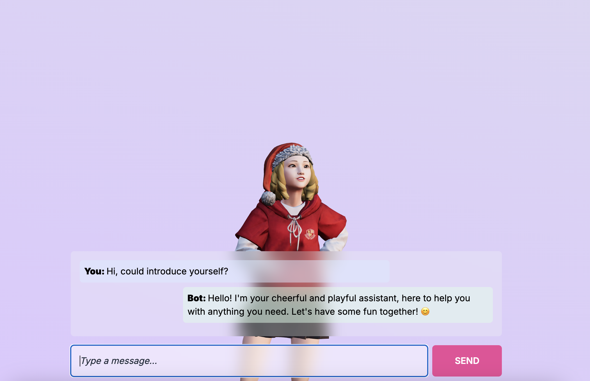

<div align="center">
  
</div>

## Overview

Welcome to the Avatar Chatbot project! This project aims to create an engaging and interactive chatbot that users can interact with using an avatar interface. The Avatar Chatbot enhances user experience by adding a visual and dynamic component to traditional text-based chatbots.

<p align="center">
    </img>
</p>


## Quickstart

Avatar Chatbot is implemented with complete frontend and backend separation, allowing users to independently develop components they are interested in while maintaining minimal dependencies. 

This means that users do not need to install large additional packages such as **Gradio**, **Streamlit**, **Chainlit**, or **Langchain**. Users can expand according to their own needs.

### Prerequisites

#### API Key

The only requirement for Avatar Chatbot is an OpenAI API Key (Only for Text Generation and Text to Speech). Users simply need to place their API Key in the environment variables (`.env` file) to successfully run the project.

- OPENAI_API_KEY

#### Dev. Environment

- Python 3.10
- Ubuntu 20.04
  
#### Note

Currently, Huggingface Models are not supported, but users can independently extend the related model inference modules!

### Clone Project

```sh
git clone https://github.com/kiangkiangkiang/avatar-chatbot.git
cd avatar-chatbot
```

### Launch Frontend Services

To get started with the frontend of the Avatar Chatbot, please follow these steps:

```sh
cd frontend
yarn
yarn dev
```

Now, you have started the frontend service. You can directly visit `http://localhost:5173` to check the current status. 

(Conversation is not possible at the moment because the backend has not been started yet.)

Any changes needed for the UI can be fully referenced from the contents inside the `./frontend` directory. For changes related to the avatar, you can refer to the #Customize-Avatar section.

### Launch Backend Services

*Don't forget put your Open API Key in `.env` file!*

#### Install Dependency

```sh
pip install -r requirements.txt
```

#### Launch Flask API

```sh
python -m chatbot
```

Now, your backend chatbot service is set up at `http://localhost:3000`. Therefore, you can go to `http://localhost:5173` and try typing to chat with the Avatar!

Any chatbot-related configurations can be adjusted in the `./chatbot/utils/config.py` file.

The `http://localhost:3000` is set as the default in the frontend files. Therefore, if the service is expanded or modified in the future, you can adjust the backend communication port in the frontend files to ensure consistent communication.

#### Response with image

The backend currently supports image file transmission. Please encode the image in **base64** and then convert it to **utf-8** before sending it to the frontend. Additionally, ensure that the string-type image is included within the "image_data" key in the returned object.

For example:

```python
# Support in ./chatbot/utils/toy_tools.py
def read_image(file: str) -> str:
    with open(file, "rb") as image_file:
        result = base64.b64encode(image_file.read()).decode("utf-8")
    return result

image_data = read_image("./chatbot/img/sample.png")

# response is a json object with Model response and animation 
return jsonify({"messages": response, "image_data": image_data})
```

The frontend default use the `response_from_backend.image_data` to parse image.

### Optional

#### Lip-Sync Package

We use a [lip-sync package](https://github.com/DanielSWolf/rhubarb-lip-sync) to convert the MP3 files generated by GPT into a lip-sync JSON file, which is then sent to the frontend for display.

Therefore, we need to follow the steps below to install the package locally. Of course, it's possible to build without using this package, but the character's lip-sync may be out of sync.

1. Download the package
```sh
wget https://github.com/DanielSWolf/rhubarb-lip-sync/releases/download/v1.13.0/Rhubarb-Lip-Sync-1.13.0-Linux.zip
```

2. unzip & cp to workdir
```sh
unzip ./Rhubarb-Lip-Sync-1.13.0-Linux

mv ./Rhubarb-Lip-Sync-1.13.0-Linux/* <path_to_your_work_dir>/bin/
```

Then you can go to the file `./chatbot/utils/config.py` to set `USE_LIP_TOOL=True` to enable the package use.

Note: if you don't want to use the package, set it into False.

#### Customize Avatar

To customize your own Avatar, this article uses [Ready Player Me](https://readyplayer.me/) website for character modeling. Follow the steps below to personalize your avatar.

1. Go to the website of [Ready Player Me](https://readyplayer.me/)
2. Click **Try our Avatar Creator**
3. You can start to build you own avatar
4. Click **Next** to Copy the `.glb` url
5. Add the get arguments `?morphTargets=ARKit,Oculus Visemes` in your url, such as `https://models.readyplayer.me/YOUR_AVATAR_ID.glb?morphTargets=ARKit,Oculus Visemes`
6. `wget` the url to get the new avatar into your work directory
7. Use `npx gltfjsx@6.2.3 public/models/64f1a714fe61576b46f27ca2.glb -o src/components/Your-Avatar.jsx -k -r public` to build the 3D avatar profile `jsx` file.
   
Then, you can modify the origin `Avatar.jsx` by your own avatar `Your-Avatar.jsx`.


## Reference

- https://readyplayer.me/
- https://github.com/wass08/r3f-virtual-girlfriend-frontend/tree/main
- https://github.com/pmndrs/gltfjsx
- https://github.com/DanielSWolf/rhubarb-lip-sync

